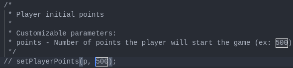
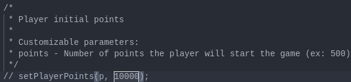
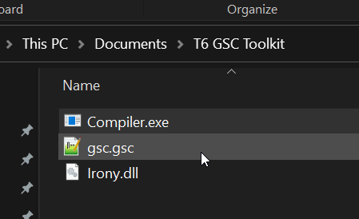
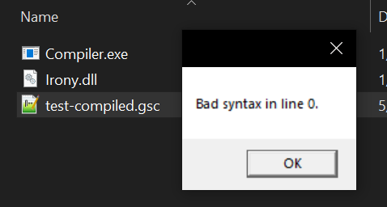
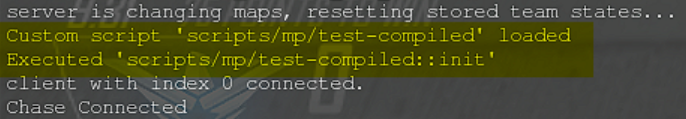

# bo2-plutonium-gsc

A bunch of mods for black ops 2 zombies

## Install

1. Download the AIO Script from the releases.

2. Edit the script with your favorite text editor, and update the functions `onConnectMods` and `onSpawnMods` by uncommenting and changing up the parameters to your liking (*All the parameters that can be customized, will be documented in the function call*).

3. Using the GSC Compiler (from GSC Toolkit), simply drag and drop your raw GSC script on top of Compiler.exe and it should spit out a compiled version.

*Note: If you get an error, make sure your script isn't already precompiled (open it, and if it looks like gibberish, it was already compiled)*

4. Grab the compiled binary, and drag and drop it into `%localappdata%\Plutonium\storage\t6\scripts\zm`, if this destination does not exist, then proceed to create it.

## Using

When launching your server or a custom game, you will know if all has gone well or not if the console prints `Custom script 'scripts/mp/yourScriptName' loaded`.

## Available Mods

* GodMode;
* Infinite ammo;
* Custom player points;
* Custom box price;
* Custom buyable perk limit;
* Perkaholic;
* Custom afterlife lifes;
* Infinite time in afterlife;
* Custom primary weapon;
* Custom secondary weapon;
* Late joined player bonus;
* Zombies counter;
* Health counter;
* Night mode;
* Custom alive zombies limit.

## Weapons List

[Source](https://github.com/Snakelegendary/BO2-Plutonium-Modding-Guide/wiki/Weapons-List)

|Unpacked Name (in-game)|Unpacked Name (GSC-name)|Packed Name (in-game)|packed Name (GSC-name)|
|--- |--- |--- |--- |
|AK-47|ak47_zm|Reznov's Revenge|ak47_upgraded_zm|
|AK74u|ak74u_zm, ak74u_extclip_zm (another version)|AK74fu2|ak74u_upgraded_zm, ak74u_extclip_upgraded_zm|
|AN-94|an94_zm|Actuated Neutralizer 94000|an94_upgraded_zm|
|B23R|beretta93r_zm, beretta93r_extclip_zm|B34R|beretta93r_upgraded_zm, beretta93r_extclip_upgraded_zm|
|Ballista|ballista_zm|Infused Arbalest|ballista_upgraded_zm|
|Ballistic Knife|knife_ballistic_zm, knife_ballistic_no_melee_zm, knife_ballistic_bowie_zm|The Krauss Refribrillator|knife_ballistic_upgraded_zm, knife_ballistic_no_melee_upgraded_zm, knife_ballistic_bowie_upgraded_zm|
|Barrett M82A1|barretm82_zm|Macro Annihilator|barretm82_upgraded_zm|
|Blundergat|blundergat_zm|The Sweeper|blundergat_upgraded_zm|
|Acid Gat|blundersplat_zm, blundersplat_explosive_dart_zm (explosive used for pap'ed acid gat), blundersplat_bullet_zm|Vitriolic Withering|blundersplat_upgraded_zm|
|Bowie Knife|bowie_knife_zm|N/A|N/A|
|Chicom CQB|qcw05_zm|Chicom Cataclismic Quadruple Burst|qcw05_upgraded_zm, sf_qcw05_upgraded_zm (select fire)|
|Claymore|claymore_zm|N/A|N/A|
|Colt M16A1|m16_zm|Skullcrusher|m16_gl_upgraded_zm|
|Death Machine|minigun_alcatraz_zm|Meat Grinder|minigun_alcatraz_upgraded_zm|
|DSR 50|dsr50_zm|Dead Specimen Reactor 5000|dsr50_upgraded_zm|
|Executioner|judge_zm|Voice of Justice|judge_upgraded_zm|
|FAL|fnfal_zm|WN|fnfal_upgraded_zm|
|Five-seven|fiveseven_zm|Ultra|fiveseven_upgraded_zm,|
|Five-seven Dual Wield|fivesevendw_zm, fivesevenlh_zm|Ultra & Violet|fivesevendw_upgraded_zm, fivesevenlh_upgraded_zm|
|Galil|galil_zm|Lemantation|galil_upgraded_zm|
|Galvaknuckles|tazer_knuckles_zm|N/A|N/A|
|EMP Grenade|emp_grenade_zm|N/A|N/A|
|HAMR|hamr_zm|SLDG HAMR|hamr_upgraded_zm|
|Hell's Retriever|bouncing_tomahawk_zm|Hell's Redeemer|upgraded_tomahawk_zm|
|KAP-40|kard_zm|Karmic Atom Perforator-4000|kard_upgraded_zm|
|KSG|ksg_zm|Mist Maker|ksg_upgraded_zm|
|LSAT|lsat_zm|FSIRT|lsat_upgraded_zm|
|M8A1|xm8_zm|Micro Aerator|xm8_upgraded_zm|
|M14|m14_zm|Mnesia|m14_upgraded_zm|
|M27|hk416_zm,|Mystifier|hk416_upgraded_zm|
|M1216|srm1216_zm|Mesmerizer|srm1216_upgraded_zm|
|M1911|m1911_zm|Mustang & Sally|m1911_upgraded_zm, m1911lh_upgraded_zm|
|M1927|thompson_zm|Speakeasy|thompson_upgraded_zm|
|Mauser C96|c96_zm|BOOMHILDA|c96_upgraded_zm|
|MP-40|mp40_zm, mp40_stalker_zm (diff version,fast ads walk speed)|The Afterburner|mp40_upgraded_zm, mp40_stalker_upgraded_zm|
|Monkey Bomb|cymbal_monkey_zm|N/A|N/A|
|MP5|mp5k_zm|MP115 Kollider|mp5k_upgraded_zm|
|MG08/15|mg08_zm|Magna Collider|mg08_upgraded_zm|
|MTAR|tar21_zm|Malevolent Toxonomic Anodized Redeemer|tar21_upgraded_zm|
|Olympia|rottweil72_zm|Hades|rottweil72_upgraded_zm|
|Paralyzer|slowgun_zm|Petrifier|slowgun_upgraded_zm|
|PDW-57|pdw57_zm|Predictive Death Wish 57000|pdw57_upgraded_zm|
|Python|python_zm|Cobra|python_upgraded_zm|
|RPD|rpd_zm|Relativistic Punishment Device|rpd_upgraded_zm|
|RPG|usrpg_zm|Rocket Propelled Grievance|usrpg_upgraded_zm|
|Ray Gun|ray_gun_zm|Porter's X2 Ray Gun|ray_gun_upgraded_zm|
|Remington 870 MCS|870mcs_zm|Refitted-870 Mechanical Cranium Sequencer|870mcs_upgraded_zm|
|Ray Gun Mark II|raygun_mark2_zm|Porter's Mark II Ray Gun|raygun_mark2_upgraded_zm|
|Remington New Model Army|rnma_zm|SASSAFRAS|rnma_upgraded_zm|
|Skorpion EVO|evoskorpion_zm|Evolved Death Stalker|evoskorpion_upgraded_zm|
|S12|saiga12_zm|Synthetic Dozen|saiga12_upgraded_zm|
|SMR|saritch_zm|SM1L3R|saritch_upgraded_zm, dualoptic_saritch_upgraded_zm|
|Semtex|sticky_grenade_zm|N/A|N/A|
|SCAR-H|scar_zm|ARGARTHAN REAPER|scar_upgraded_zm|
|STG-44|mp44_zm|Spatz-447+|mp44_upgraded_zm|
|SVU-AS|svu_zm|Shadowy Veil Utilizer|svu_upgraded_zm|
|Time Bomb|time_bomb_zm, time_bomb_detonator_zm|N/A|N/A|
|Type 25|type95_zm|Strain 25|type95_upgraded_zm|
|Uzi|uzi_zm|Uncle Gal|uzi_upgraded_zm|
|War Machine|m32_zm|Dystopic Demolisher|m32_upgraded_zm|
|(no name)|electrocuted_hands_zm|N/A|N/A|
|G-Strike|beacon_zm|N/A|N/A|
|WEAPON_DEFAULTWEAPON|defaultweapon_mp|N/A|N/A|
|Maxis Drone|equip_dieseldrone_zm|N/A|N/A|
|Electric Trap|equip_electrictrap_zm|N/A|N/A|
|Frag Grenade|frag_grenade_zm|N/A|N/A|
|Jet Gun|jetgun_zm|(?)|jetgun_upgraded_zm (?)|
